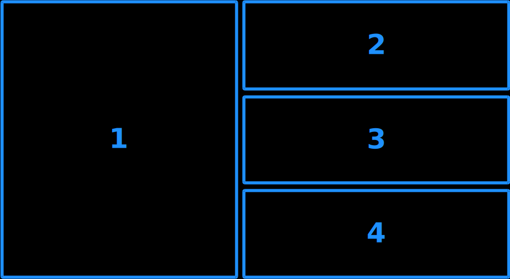

# VS Code Dynamic Layouts

This VS Code extension provides [dynamic tiling](https://en.wikipedia.org/wiki/Dynamic_window_manager) features on top of VS Code's [editor groups](https://code.visualstudio.com/docs/getstarted/userinterface#_editor-groups). In short, VS Code Dynamic Layouts manages the positions of your editors so that you don't have to. When you open a window it will automatically tile into the layout of your choice. VS Code Dynamic Layouts is inspired by tiling window managers like XMonad, DWM, and Awesome, and should feel familiar to those who use them.

## Layouts
VS Code Dynamic Layouts supports the following layouts.
### Tall
A.K.A. the "Master and Stack" layout. Your first window will be positioned on the left half of the screen, and the rest will be stacked on the right half.


## Commands
VS Code Dynamic Layouts contributes the following commands:

* `vscode-dynamic-layouts.openGroup`

    Opens a new editor group. Groups are placed in the position before the current group. Use this to open files from the file explorer.
* `vscode-dynamic-layouts.quickOpen`
    
    Opens a new editor group, then executes `workbench.action.quickOpen`. Groups are placed in the position before the current group. Use this instead of [Quick Open](https://code.visualstudio.com/docs/editor/editingevolved).
* `vscode-dynamic-layouts.closeGroup`

    Closes the current editor group and retiles the remaining groups.
* `vscode-dynamic-layouts.focusNextGroup`

    Focuses the next editor group in the layout.
* `vscode-dynamic-layouts.focusPreviousGroup`

    Focuses the previous editor group in the layout.
* `vscode-dynamic-layouts.swapNextGroup`

    Swaps the current editor group with the next group in the layout.
* `vscode-dynamic-layouts.swapPreviousGroup`

    Swaps the current editor group with the previous group in the layout.
## Keybindings
VS Code Dynamic Layouts contributes the following keybindings.
### Default
```
"keybindings": [
    {
        "command": "vscode-dynamic-layouts.focusNextGroup",
        "key": "ctrl+alt+j",
        "mac": "ctrl+alt+j"
    },
    {
        "command": "vscode-dynamic-layouts.focusPreviousGroup",
        "key": "ctrl+alt+k",
        "mac": "ctrl+alt+k"
    },
    {
        "command": "vscode-dynamic-layouts.swapNextGroup",
        "key": "ctrl+shift+j",
        "mac": "ctrl+shift+j"
    },
    {
        "command": "vscode-dynamic-layouts.swapPreviousGroup",
        "key": "ctrl+shift+k",
        "mac": "ctrl+shift+k"
    },
    {
        "command": "vscode-dynamic-layouts.quickOpen",
        "key": "ctrl+alt+p",
        "mac": "ctrl+alt+p"
    },
    {
        "command": "vscode-dynamic-layouts.closeGroup",
        "key": "ctrl+alt+q",
        "mac": "ctrl+alt+q"
    }
]
```
### Recommended
```
"keybindings": [
    {
        "command": "vscode-dynamic-layouts.focusNextGroup",
        "key": "ctrl+j",
        "mac": "ctrl+j"
    },
    {
        "command": "vscode-dynamic-layouts.focusPreviousGroup",
        "key": "ctrl+k",
        "mac": "ctrl+k"
    },
    {
        "command": "vscode-dynamic-layouts.swapNextGroup",
        "key": "ctrl+shift+j",
        "mac": "ctrl+shift+j"
    },
    {
        "command": "vscode-dynamic-layouts.swapPreviousGroup",
        "key": "ctrl+shift+k",
        "mac": "ctrl+shift+k"
    },
    {
        "command": "vscode-dynamic-layouts.quickOpen",
        "key": "ctrl+p",
        "mac": "ctrl+p"
    },
    {
        "command": "vscode-dynamic-layouts.closeGroup",
        "key": "ctrl+q",
        "mac": "ctrl+q"
    }
]
```
## Getting Started
1. Install the extension.
2. Open a few editors using `vscode-dynamic-layouts.quickOpen` [ctrl+alt+p].
3. Change the focused editor using `vscode-dynamic-layouts.focusNextGroup` [ctrl+alt+j] or `vscode-dynamic-layouts.focusPreviousGroup` [ctrl+alt+k].
4. Move an editor within the layout using `vscode-dynamic-layouts.swapNextGroup` [ctrl+shift+j] or `vscode-dynamic-layouts.swapPreviousGroup` [ctrl+shift+k].
5. Close each editor using `vscode-dynamic-layouts.closeGroup` [ctrl+alt+q]


## Tips
For best results, prefer the VS Code Dynamic Layouts commands over their default counterparts. They should be used to:
- Open editors
- Focus editors
- Move editors
- Close editors

Combining these commands with others that are not provided by the extension may lead to unexpected behavior.
## Release Notes


### 1.0.0

Initial release of VS Code Dynamic Layouts